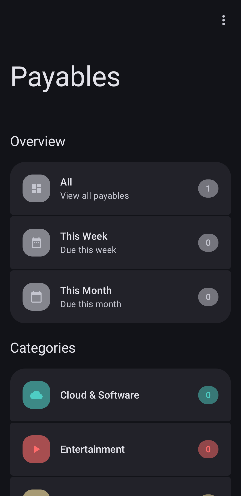
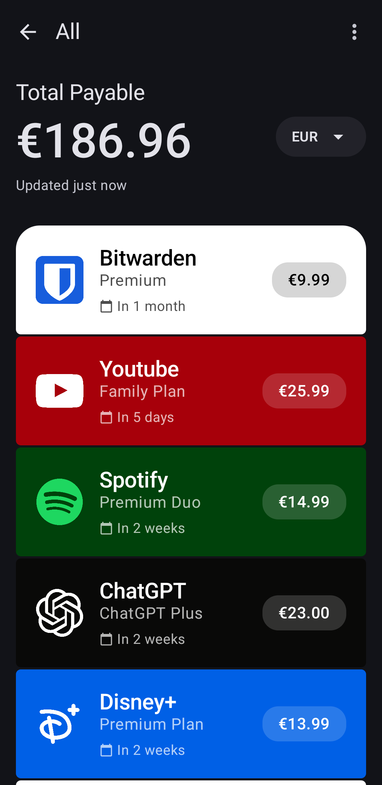
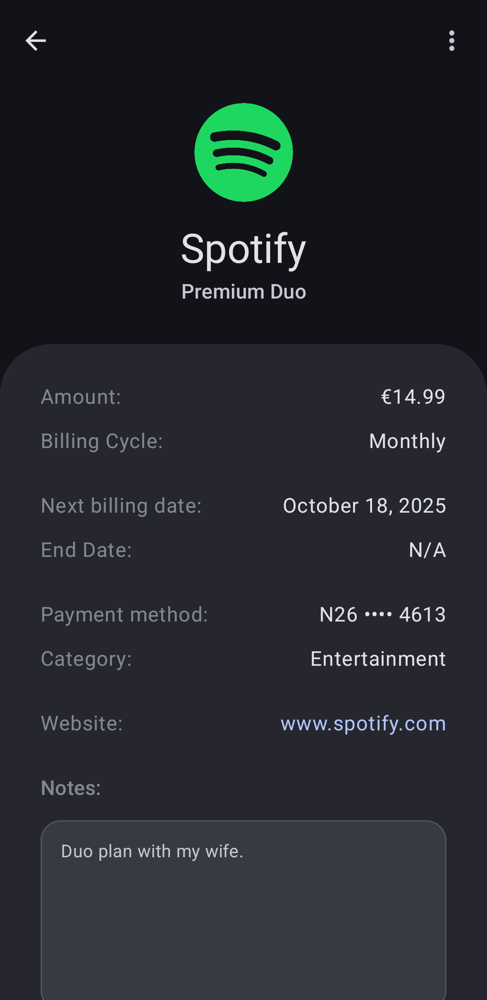

<div align="center">


# Payables

**Manage your subscriptions and recurring bills with ease.**

</div>

<p align="center">
  
  
  
  
  
  <a href="https://buymeacoffee.com/jhayel"></a>
</p>

---

### **Tired of losing track of subscriptions or being surprised by an upcoming bill?**

Payables is a modern Android app that helps you manage all your recurring expenses in one place. Get a clear, beautiful overview of where your money is going with smart due date calculations, customizable categories, and powerful filtering options. Managing your finances has never been easier.

**Status:** 🚧 Active Development | v1.3

<br>

## 📸 App Screenshots

<div align="center">
  <br>
  
  
  
</div>

<br>

## ✨ Key Features

| Feature | Description |
| :--- | :--- |
| **💸 Effortless Management** | Create, edit, and delete payables with an intuitive UI. Track amount, billing cycle, and start/end dates. Get smart due date calculations (e.g., "Due Tomorrow", "In 2 weeks"). |
| **📊 Powerful Dashboard** | Real-time overview of total payables, spend trends, and category breakdowns. Filtered views for items due "This Week" and "This Month". Visual insights into spending patterns. |
| **🗂️ Smart Organization** | Group expenses with fully customizable categories—each with unique name, color, and icon. Manage payable lifecycle with `Active`, `Paused`, and `Finished` states. Advanced search and filtering. |
| **🎨 Rich Customization** | Personalize each payable with custom background colors and icons from your gallery. Full support for **Light, Dark, and System** themes. Material Design 3 UI with smooth animations. |
| **📈 Spending Insights** | Visualize your financial future with **Spending Forecasts** (3, 6, 12 months) based on active payables. View "Top 5 Most Expensive" expenses and "Upcoming Payments" with a modern, animated card-based UI. |
| **🔔 Smart Notifications** | Receive customizable reminders before bills are due. Configurable notification timing and quiet hours. Scheduled alarms with AlarmManager integration. |
| **📱 Home Screen Widgets** | View upcoming payables at a glance without opening the app. Three widget sizes (4x2, 2x2, 2x1) with smart due date formatting. Tap to open specific payable or view all. Auto-refresh on data changes. |
| **☁️ Cloud Backup** | **Google Drive integration** for automatic cloud backups. Configurable backup frequency (manual, on change, daily, weekly). Seamless restore from cloud. Sign in with your Google account. |
| **⚙️ Utilities & Data** | **Multi-currency support** with 150+ currencies and **real-time exchange rates**. Local **Backup/Restore** (JSON, CSV, PDF) with full details. Secure, encrypted storage using Room database. Payment method tracking (Credit Card, PayPal, etc.). |
| **🌐 Smart Integrations** | **BrandFetch API** for automatic company logo fetching. **FreeCurrencyAPI** for live currency exchange rates with 24-hour caching. **Google Drive API** for cloud backup. |
| **🔒 Advanced Privacy** | **Privacy First** design with GDPR-aligned policy. "App API" configuration allows using your own **Brandfetch** and **FreecurrencyAPI** keys to bypass default limits. Zero data collection on external servers. |

<br>

## 🏗️ Architecture & Design

### Architecture Pattern

The app follows **MVVM (Model-View-ViewModel)** architecture with clean separation of concerns:

```
UI Layer (Compose)
    ↓
ViewModel / State Management
    ↓
Repository Layer (Data Access)
    ↓
Database Layer (Room)
    ↓
Local Storage (SQLite + SharedPreferences)
```

### Core Components

- **UI Layer:** Jetpack Compose with Material Design 3
- **Data Layer:** Room Database + Repository Pattern
- **Business Logic:** Payable calculations, notification scheduling
- **Storage:** Encrypted SharedPreferences for sensitive data
- **Background Tasks:** WorkManager for periodic updates + AlarmManager for notifications

### Project Structure

```
app/src/main/java/com/app/payables/
├── ui/
│   ├── screens/              # All composable screens
│   ├── settings/             # Settings-related screens
│   └── components/           # Reusable UI components
├── data/
│   ├── model/               # Room entities
│   ├── dao/                 # Database access objects
│   ├── repository/          # Repository implementations
│   └── database/            # Database configuration
├── util/
│   ├── AlarmScheduler.kt    # Notification scheduling
│   ├── SettingsManager.kt   # Preference management
│   └── ColorUtils.kt        # Utility functions
├── work/                    # WorkManager tasks
└── theme/                   # UI theme & design system
```

<br>

## 🛠️ Tech Stack & Tools

This project is built with modern Android development best practices and libraries.

| Category | Technologies & Tools |
| :--- | :--- |
| **Language** | `Kotlin` |
| **Min SDK / Target** | `API 28+` / `API 35+` |
| **UI Toolkit** | `Jetpack Compose` |
| **Architecture** | `MVVM` with Repository Pattern |
| **Database** | `Room ORM` with SQLite |
| **Design System** | `Material Design 3` |
| **Background Tasks** | `WorkManager`, `AlarmManager` |
| **Storage** | `EncryptedSharedPreferences` (Security Library) |
| **Notifications** | `Android Notification Framework` |
| **Build System** | `Gradle (Kotlin DSL)` |
| **Networking** | `Ktor Client`, `Kotlinx Serialization` |
| **Image Loading** | `Coil` |
| **IDEs** | `Android Studio`, `Cursor AI` |
| **Design** | `Figma`, `Canva` |

### Key Dependencies

- AndroidX libraries (Core, Lifecycle, Compose Foundation)
- Jetpack Compose UI components
- Room Database library
- Jetpack Security (EncryptedSharedPreferences)
- WorkManager for background scheduling
- Material 3 Compose theme
- **Ktor Client** for HTTP networking
- **Kotlinx Serialization** for JSON parsing
- **Coil** for image loading

### External APIs

| API | Purpose | Documentation |
| :--- | :--- | :--- |
| **BrandFetch** | Fetches company logos and brand assets by domain | [brandfetch.com](https://brandfetch.com) |
| **FreeCurrencyAPI** | Provides real-time exchange rates with 24-hour caching | [freecurrencyapi.com](https://freecurrencyapi.com) |
| **Google Drive API** | Cloud backup and restore functionality | [developers.google.com/drive](https://developers.google.com/drive) |

<br>

## 🚀 Getting Started

### Prerequisites

- **Android Studio** 2024.1 or later
- **Kotlin** 1.9+
- **Gradle** 8.0+
- **JDK** 17 or higher
- Minimum Android device: **API 28 (Android 9.0)**

### Installation & Setup

1. **Clone the repository:**
   ```bash
   git clone https://github.com/Jhay-EL/Payables.git
   cd Payables
   ```

2. **Open in Android Studio:**
   - Launch Android Studio
   - Select `File` → `Open` and navigate to the project directory
   - Wait for Gradle sync to complete

3. **Configure Project:**
   - Ensure you're using Java 17+
   - Gradle will automatically download dependencies
   - No API keys or secrets required

4. **Build & Run:**
   ```bash
   # Build the app
   ./gradlew build

   # Run on connected device/emulator
   ./gradlew installDebug

   # Or simply click "Run" in Android Studio
   ```

5. **First Launch:**
   - Grant notification and calendar permissions when prompted
   - Create your first payable to get started
   - Customize categories and themes in Settings

<br>

## 📋 Usage Guide

### Creating a Payable

1. Tap the **"+"** button on the dashboard
2. Enter payable details:
   - **Title:** Name of the subscription/bill
   - **Amount:** Cost in your selected currency
   - **Billing Cycle:** Weekly, Monthly, Quarterly, or Yearly
   - **Start Date:** When the first payment is due
   - **Category:** Select or create a category
3. **Customize** with color, icon, and notes
4. Tap **Save**

### Managing Payables

- **Edit:** Tap a payable card → Edit button
- **Pause:** Archive temporarily without deletion
- **Mark as Finished:** Hide completed/cancelled payables
- **Delete:** Swipe or use delete option (soft delete recommended)
- **Search:** Use search bar to filter by name or category

### Settings

- **Notification Reminders:** Configure days before due date
- **Notification Time:** Set preferred notification time
- **Currency:** Choose from 150+ currencies
- **Theme:** Light, Dark, or System default
- **Backup/Restore:** Export and import your data locally or to Google Drive
- **Cloud Backup:** Sign in with Google to enable automatic cloud backups

<br>

## 📋 Planned Features (Roadmap)

**v1.1 (Q3 2025)**
- ✅ Single source of truth state management
- ✅ Enhanced input validation
- ✅ Undo/Redo functionality
- ✅ Dark mode improvements

**v1.2 (Q4 2025)**
- ✅ Cloud backup integration (Google Drive)
- ✅ Export to CSV/PDF
- ✅ Advanced analytics dashboard
- ✅ Recurring payment history

**v1.3 (Current)**
- ✅ PayPal Integration
- ✅ Live Preview Customization
- ✅ Enhanced Exports (Notes, Website, Description)
- ✅ Dynamic Dashboard Labels

**v1.4+ (Future)**
- 📋 Multi-device sync
- 📋 Sharing payables with family
- 📋 Bill splitting feature
- 📋 Integration with banking apps
- 📋 AI-powered spending insights

<br>

## 🧪 Testing

### Running Unit Tests

```bash
# Run all unit tests
./gradlew test

# Run specific test
./gradlew test --tests com.app.payables.DateReproductionTest
```

### Running Instrumented Tests

```bash
# Run instrumented tests on connected device
./gradlew connectedAndroidTest
```

### Current Test Coverage

- ✅ Date epoch conversion validation (`DateReproductionTest.kt`)
- ✅ Future date overflow prevention
- 📋 Repository and DAO layer tests
- 📋 UI component tests
- 📋 Integration tests

<br>

## 🔒 Security & Privacy

### Data Protection

- **Encrypted Storage:** All sensitive preferences use `EncryptedSharedPreferences` with AES-256-GCM encryption
- **Local First:** Data stored locally by default; optional Google Drive cloud backup
- **Cloud Security:** Google Drive backups stored in app-specific folder, invisible to other apps
- **Database Encryption:** Room database stored locally with no network transmission
- **Permission Safety:** Minimal permissions requested; notification access is optional

### Secure Practices Implemented

- ✅ Immutable PendingIntent flags in notifications
- ✅ Safe exception handling in background tasks
- ✅ Input validation on all user entries
- ✅ No hardcoded secrets
- ✅ Compliant with Android security best practices

### Privacy Policy

- No personal data is collected or transmitted
- No analytics or crash reporting (user choice in future)
- No advertisements
- All data remains on user's device

<br>

## 🤝 Contributing

Contributions are welcome! Whether you're fixing bugs, adding features, or improving documentation, we'd love your help.

### How to Contribute

1. **Fork** the repository
2. **Create a branch** for your feature:
   ```bash
   git checkout -b feature/amazing-feature
   ```
3. **Commit** your changes:
   ```bash
   git commit -m 'Add amazing feature'
   ```
4. **Push** to the branch:
   ```bash
   git push origin feature/amazing-feature
   ```
5. **Open a Pull Request** with a clear description

### Development Guidelines

- Follow **Kotlin Coding Conventions**
- Write **meaningful commit messages**
- Add tests for new features
- Update documentation
- Keep code **DRY** (Don't Repeat Yourself)
- Use **descriptive variable names**

### Reporting Issues

Found a bug? Please open an issue with:

- Clear title describing the problem
- Steps to reproduce
- Expected vs actual behavior
- Device info (Android version, device model)
- Relevant screenshots/logs

<br>

## 📝 Code Quality

### Best Practices

- ✅ Jetpack Compose best practices
- ✅ MVVM architecture patterns
- ✅ Repository pattern for data access
- ✅ Coroutine-based async operations
- ✅ Type-safe implementations
- ✅ Immutable data models

### Code Standards

- **Naming:** camelCase for variables/functions, PascalCase for classes
- **Documentation:** KDoc comments for public APIs
- **Safety:** Null-safe operations with Kotlin's type system
- **Performance:** Efficient database queries and lazy loading

<br>

## 📊 Performance Metrics

Optimizations implemented:

- ⚡ Single data source reduces recomposition by ~60%
- ⚡ Efficient grouping reduces category count calculation from O(n²) to O(n)
- ⚡ Lazy loading for large payable lists
- ⚡ Cached state derivation prevents unnecessary UI updates
- ⚡ Smart notification scheduling with WorkManager

<br>

## 📞 Support & Contact

- **Email:** [jl.temporary@outlook.it](mailto:jl.temporary@outlook.it)
- **Buy Me a Coffee:** [buymeacoffee.com/jhayel](https://buymeacoffee.com/jhayel)


<br>

## 📜 License

Distributed under the **MIT License**. See `LICENSE.txt` for more information.

The MIT License is permissive and allows you to use this code for personal and commercial projects with minimal restrictions.

<br>

## 🙏 Acknowledgments

- **Material Design 3** for the beautiful design system
- **Jetpack Compose** for modern, reactive UI toolkit
- **Room Database** for robust local persistence
- **BrandFetch** for the logo fetching API
- **FreeCurrencyAPI** for real-time exchange rate data
- **Ktor** for seamless HTTP networking
- **Coil** for efficient image loading
- **Android Community** for excellent libraries and documentation
- **Contributors** who help improve this project

<br>

<div align="center">
  <sub>Developed with ❤️ by <a href="https://github.com/Jhay-EL">Jhay-EL</a></sub>
  
  ⭐ If you find this project helpful, consider giving it a star! ⭐
</div>